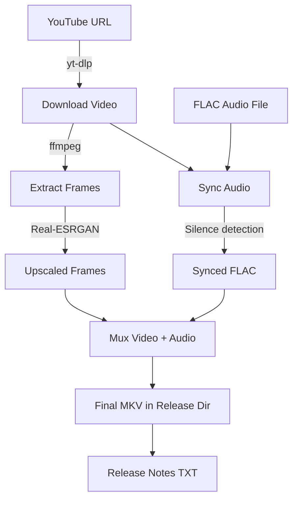

# Music Video Upscale Project

> High-quality AI-upscaled music videos with lossless FLAC audio

## Project Overview

This project creates high-quality music videos where:
- **Video**: AI-upscaled to 2K or 4K using Real-ESRGAN
- **Audio**: Lossless FLAC replaced with synced CD/studio rips

The workflow takes YouTube music videos, upscales them using AI, and muxes with lossless audio for archival-quality releases.

---

## Upscaling Rules

| Source Resolution | Scale Factor | Model | Final Resolution |
|-------------------|--------------|-------|------------------|
| < 1080p (e.g. 240p, 360p, very noisy YouTube) | 4x | `realesr-general-wdn-x4v3` | Up to 4K |
| < 1080p (e.g. 480p, 720p typical YouTube) | 4x | `realesr-general-x4v3` *(default)* | Up to 4K |
| 1080p clean | 2x | `realesr-animevideov3` | 4K (3840×2160) |
| 1080p photographic / pristine | 2x | `realesrgan-x4plus` *(rarely best)* | 4K |

> [!IMPORTANT]
> Final video should **never exceed 4K** (3840×2160 or 4096×2160).
> The pipeline default model is `realesr-general-x4v3` — the `-wdn-x4v3` twin is the stronger-denoise variant for very compressed sources.
> The `realesr-animevideov3` model has native 2x support and avoids tiling artifacts.

---

## Pipeline Workflow



### Pipeline Steps

1. **Sanitize** (`00_sanitize.ps1`) - Normalize filenames (lowercase, remove special chars including apostrophes and quotes)
2. **Sync Audio** (`01_sync_audio.ps1`) - Compare FLAC with YouTube audio, add silence padding if needed
3. **Extract Frames** (`02_extract.ps1`) - Extract frames as PNG at native framerate
4. **Upscale** (`03_upscale.ps1`) - AI upscale each frame using Real-ESRGAN
5. **Mux** (`04_mux.ps1`) - Combine upscaled frames with synced FLAC audio into MKV

---

## Key Scripts

| Script | Purpose |
|--------|---------|
| `run_pipeline.ps1` | Complete automated pipeline (all steps) |
| `upscale_video.ps1` | Full-featured standalone upscaler with options |
| `monitor_progress.ps1` | Watch upscale progress (frame count) |
| `00-04_*.ps1` | Individual pipeline stage scripts |

---

## Directory Structure

```
c:\music_videos\
├── .gemini\                    # Project config (this file)
├── models\                     # Real-ESRGAN model files
├── {artist}\                   # Working directories per artist
│   ├── {video}.mp4/webm       # Source video
│   ├── {audio}.flac           # Source lossless audio
│   ├── tmp_frames\            # Extracted PNG frames  
│   ├── tmp_upscaled_{N}x\     # Upscaled frames
│   └── output\                 # Intermediate output
└── METAL_VIDS_UPSCALED_FLAC\  # Final releases
    └── {ARTIST}\              # Artist name in CAPS
        ├── {song}_HQ.mkv      # Final upscaled video
        └── {song}_HQ.txt      # Release notes
```

---

## Tools & Requirements

- **yt-dlp.exe** - YouTube video downloader
- **realesrgan-ncnn-vulkan.exe** - AI upscaler (Vulkan GPU acceleration)
- **ffmpeg/ffprobe** - Video processing (must be in PATH)

### Available Models

| Model | Best For | Scales |
|-------|----------|--------|
| `realesr-general-x4v3` *(default)* | Compressed YouTube sources (any res); preserves texture | 4x |
| `realesr-general-wdn-x4v3` | Same architecture, stronger denoising for 240p–360p | 4x |
| `realesrgan-x4plus` | Genuinely clean live-action sources (BD/DVD remasters, official 1080p) | 4x |
| `realesr-animevideov3` | Anime/animation content, native 2x/3x/4x | 2x, 3x, 4x |
| `realesrgan-x4plus-anime` | Anime stills with 4x upscale | 4x |

The standalone Real-ESRGAN ncnn-vulkan binary does **not** support a `-dn`
denoise flag (Python-only). To control denoise strength on ncnn, switch model
between `realesr-general-x4v3` and `realesr-general-wdn-x4v3`.

---

## Release Output Format

Releases are saved to `METAL_VIDS_UPSCALED_FLAC\{ARTIST}\` with:
- **MKV container** (supports lossless FLAC audio)
- **H.264 video** at CRF 18 (high quality)
- **FLAC audio** (losslessly copied)
- **Release notes TXT** with technical details

### Release Notes Template

```
{ARTIST} - {Song Title}
===========================

Release Information
-------------------
Upscaling:    Real-ESRGAN ({model} x{scale})
Scale Factor: {scale}x
Source:       {source_width}x{source_height} ({resolution_name})
Output:       {output_width}x{output_height} ({output_resolution})

Video Details
-------------
Container:    Matroska (MKV)
Video Codec:  H.264/AVC
Resolution:   {output_width}x{output_height}
Frame Rate:   {fps} fps
CRF:          18 (high quality)
Preset:       slow

Audio Details
-------------
Audio Codec:  FLAC (Free Lossless Audio Codec)
Source:       Lossless CD rip

Technical Notes
---------------
- {any special notes about this release}

Date:         {YYYY-MM-DD}
```

---

## Common Commands

### Full Pipeline
```powershell
.\run_pipeline.ps1 -TargetFolder .\{artist} -YouTubeUrl "https://..." -Scale 4
```

### Manual Upscale (with options)
```powershell
.\upscale_video.ps1 `
    -InputVideo ".\{artist}\video.mp4" `
    -InputAudio ".\{artist}\audio.flac" `
    -Scale 2 `
    -Model "realesr-animevideov3" `
    -YouTubeUrl "https://..."
```

### Monitor Progress
```powershell
.\monitor_progress.ps1 -TargetFrames 8000 -Directory ".\{artist}\tmp_upscaled_4x"
```

### Mux Only (after upscaling)
```powershell
.\04_mux.ps1 `
    -FramesDir ".\{artist}\tmp_upscaled_4x" `
    -AudioPath ".\{artist}\video_synced.flac" `
    -OriginalVideo ".\{artist}\video.mp4" `
    -OutputVideo ".\METAL_VIDS_UPSCALED_FLAC\ARTIST\song_HQ.mkv"
```

---

## Audio Sync Notes

The sync detection:
1. Downloads YouTube audio (if URL provided)
2. Detects silence at start of YouTube/video audio
3. Detects silence at start of FLAC
4. Adds padding silence to FLAC if video has more intro silence
5. Creates `{name}_synced.flac` file

> [!TIP]
> If audio/video durations differ significantly (>1s), there may be edits in the music video that require manual sync adjustments.

---

## Completed Releases

Releases organized by artist in `METAL_VIDS_UPSCALED_FLAC\`:
- ANNIHILATOR
- AT THE GATES
- CARCASS  
- DEATH
- IMMORTAL
- MEGADETH
- PESTILENCE
- SAMAEL
- SEPULTURA
- SLAYER
